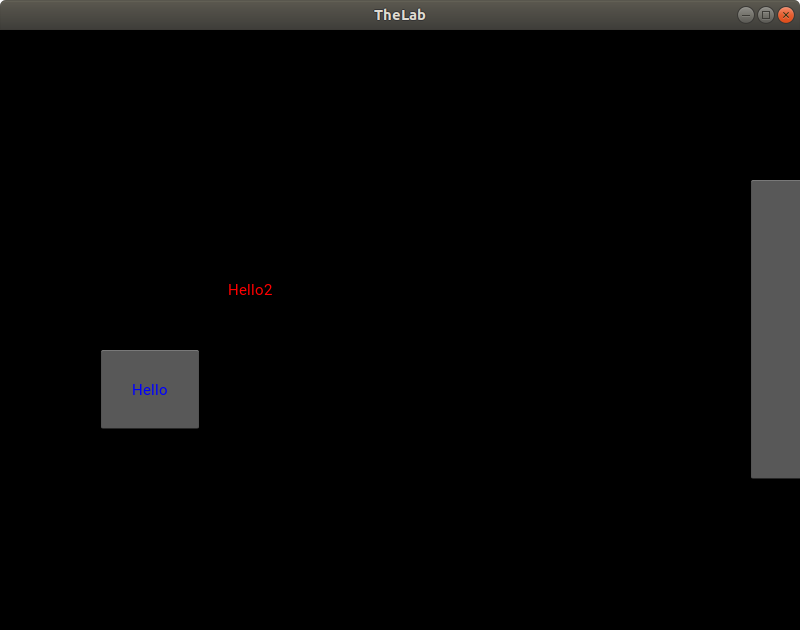
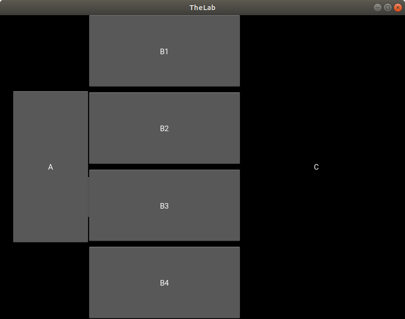
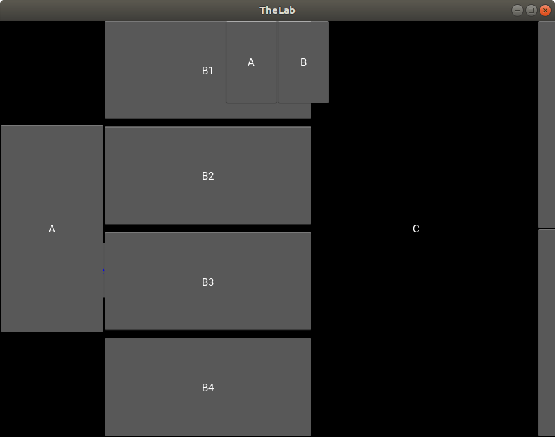
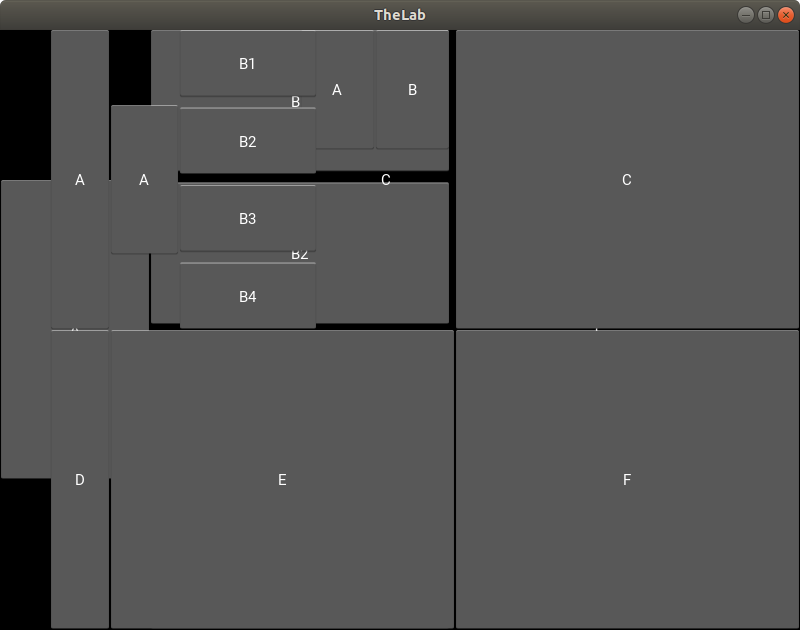

In this Project you will find the first Steps for programming with Kivy.

In every directory will be a full project, which you can copy on your IDE.
You need for the build.yml workflow the right directory for building an APK. 
This directory is the one, where your main and the kivy for this main is living.

For every new APK you will change title and package.name in buildozer.spec.
Please have a look for the include_patterns and exclude_dirs for your APK!

TheLab_01_FirstSteps shows you different Layouts and Buttons.
It uses the PageLayout and shows, how the Buttons are overlayed at the last screen.

There are 4 screens.

**First**

Button and Label

**Second**

5 Buttons overlayed. You can see the Label of the first screen.

**third**

Only two little Buttons at the top.

**fourth**

Another 9 Buttons.

